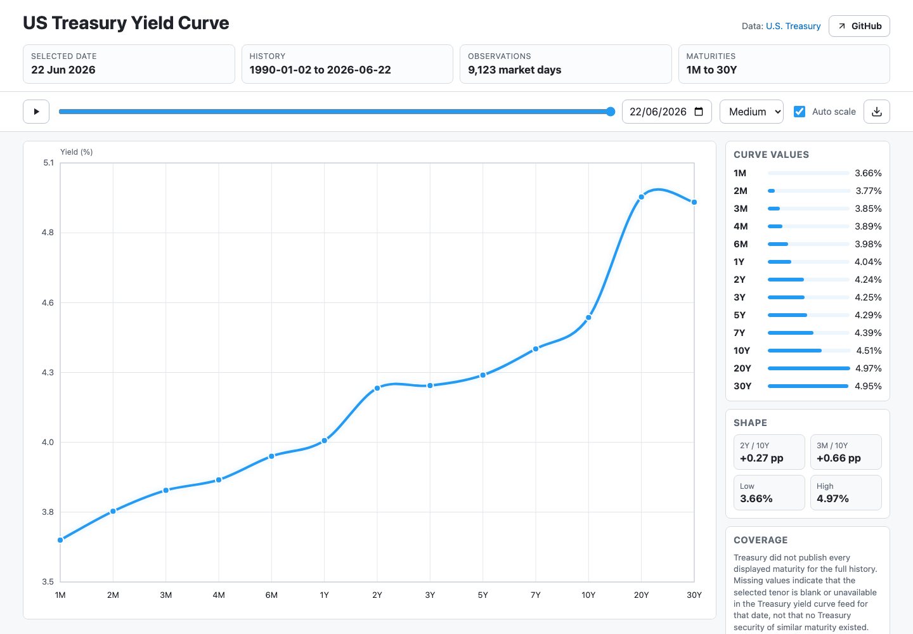

# US Treasury Yield Curve

Static GitHub Pages site for an animated US Treasury yield curve history.

[](https://fujiapple852.github.io/yield/)



## Build locally

```sh
python3 scripts/build_yield_curve_site.py --output-dir public
```

The build pulls daily Treasury par yield curve XML data from 1990 through the current year, then writes:

- `data/us_treasury_yield_curve_history.csv`
- `public/index.html`
- `public/us_treasury_yield_curve_history.csv`

The CSV under `data/` is the persisted history. Normal builds read it first and fetch only the last stored year through the current year, then merge rows by date. Use `--full-refresh` to rebuild the entire history from Treasury.

## Deploy

GitHub Actions runs `.github/workflows/deploy-pages.yml` on weekdays at 23:05 UTC and on manual dispatch. Treasury says yield curve rates are usually available by 6:00 PM Eastern Time each trading day; that is 22:00 UTC during daylight saving time and 23:00 UTC during standard time, so this schedule runs shortly after the publication window year-round. The workflow fetches the latest Treasury data incrementally, commits `data/us_treasury_yield_curve_history.csv` when it changes, builds the static site into `public/`, uploads the Pages artifact, and deploys it with GitHub Pages.

In the repository settings, set Pages to use **GitHub Actions** as the source.

## License

The project code and non-data site/documentation assets are released under the [MIT License](LICENSE).

The Treasury source data and normalized CSV history are not covered by the MIT License. See [DATA_LICENSE.md](DATA_LICENSE.md) for the data notice.

## Data

Yield curve data comes from the U.S. Department of the Treasury's [Daily Treasury Par Yield Curve Rates](https://home.treasury.gov/resource-center/data-chart-center/interest-rates/TextView?type=daily_treasury_yield_curve) and XML feed.

The original Treasury data is a work of the United States Government. Under [17 U.S.C. § 105](https://www.law.cornell.edu/uscode/text/17/105), copyright protection is not available for works of the United States Government. This project does not claim copyright over the original Treasury data and is not affiliated with or endorsed by the U.S. Department of the Treasury.
